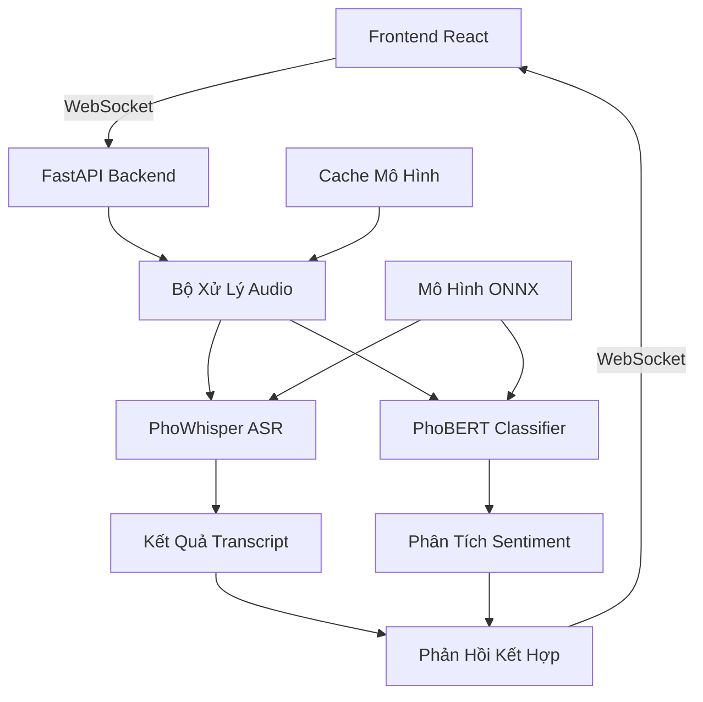

# 🎤 Demo Nhận Dạng Giọng Nói Tiếng Việt + Phát Hiện Nội Dung Độc Hại

<div align="center">


**Demo nhận dạng giọng nói tiếng Việt thời gian thực với khả năng phát hiện nội dung độc hại sử dụng các mô hình AI tiên tiến**

[🚀 Bắt Đầu Nhanh](#-bắt-đầu-nhanh) • [📖 Hướng Dẫn Sử Dụng](./HUONG_DAN_SU_DUNG.md) • [🔧 Cài Đặt](#-cài-đặt) • [📊 Tính Năng](#-tính-năng)

</div>

## 🌟 Tổng Quan

Đây là **demo sẵn sàng production** thể hiện khả năng nhận dạng giọng nói tiếng Việt thời gian thực với phát hiện nội dung độc hại tiên tiến. Được xây dựng bằng các công nghệ web hiện đại và sử dụng các mô hình AI tiếng Việt tiên tiến từ VinAI Research.

### 🎯 Tính Năng Chính

- 🎤 **Nhận dạng giọng nói tiếng Việt thời gian thực** sử dụng mô hình PhoWhisper-small
- 🛡️ **Phát hiện nội dung độc hại** với phân tích sentiment 4 lớp
- ⚡ **Tối ưu ONNX** tăng hiệu suất 2-3 lần
- 🔄 **Giao tiếp WebSocket** cho streaming độ trễ thấp
- 📊 **Hiển thị độ tin cậy** với phân tích chi tiết
- ⚠️ **Tô sáng thông minh** nội dung không phù hợp
- 🎨 **Giao diện hiện đại** với hiển thị waveform thời gian thực

## 🚀 Bắt Đầu Nhanh

```bash
# 1. Clone repository
git clone https://github.com/your-username/vietnamese-stt-demo.git
cd vietnamese-stt-demo

# 2. Chạy setup tự động (tải models + cài dependencies)
python setup.py

# 3. Khởi động demo
python start.py
```

**Xong rồi!** 🎉 Mở http://localhost:5173 và bắt đầu nói tiếng Việt!

## 📖 Tài Liệu

- **[📋 Hướng Dẫn Sử Dụng Chi Tiết](./HUONG_DAN_SU_DUNG.md)** - Hướng dẫn setup, cấu hình và xử lý sự cố
- **[🔧 Tài Liệu API](http://localhost:8000/docs)** - Tài liệu FastAPI tương tác (khi đang chạy)
- **[🎯 Tổng Quan Tính Năng](#-tính-năng)** - Danh sách tính năng đầy đủ

## 🔧 Cài Đặt

### Yêu Cầu Hệ Thống

- **Python**: 3.10+ (khuyến nghị 3.12)
- **Node.js**: 18+ (cho frontend)
- **RAM**: 4GB tối thiểu (8GB+ khuyến nghị cho models)

### Setup Tự Động (Khuyến nghị)

```bash
# Setup hoàn chỉnh: backend + frontend + models + chuyển đổi ONNX
python setup.py
```

### Setup Thủ Công

<details>
<summary><b>Setup Backend</b></summary>

```bash
cd backend
pip install -r requirements.txt

# Khởi động backend
python start.py
# hoặc
python -m uvicorn app.main:app --reload --host 0.0.0.0 --port 8000
```

</details>

<details>
<summary><b>Setup Frontend</b></summary>

```bash
cd frontend
npm install
npm run dev
```

</details>

## 📊 Tính Năng

### 🎤 Nhận Dạng Giọng Nói
- **PhoWhisper-small**: 86% độ chính xác trên benchmark ASR tiếng Việt
- **Xử lý thời gian thực**: WebSocket streaming với độ trễ thấp
- **Nhiều định dạng audio**: WebM/Opus với chuyển đổi tự động
- **Phát hiện hoạt động giọng nói**: Lọc im lặng thông minh

### 🛡️ Phân Tích Nội Dung
- **Sentiment 4 lớp**: Tích cực, Tiêu cực, Trung tính, Độc hại
- **PhoBERT Classifier**: 86% độ chính xác, 83% F1-score
- **Phát hiện từ khóa xấu**: Nội dung độc hại đặc trưng tiếng Việt
- **Chấm điểm độ tin cậy**: Phân tích chi tiết dự đoán

### ⚡ Tối Ưu Hiệu Suất
- **ONNX Runtime**: Nhanh hơn 2-3 lần so với PyTorch
- **Cache mô hình**: Tải thông minh với cơ chế fallback
- **Xử lý bất đồng bộ**: Pipeline audio không chặn
- **Tối ưu bộ nhớ**: Quản lý mô hình hiệu quả

### 🎨 Trải Nghiệm Người Dùng
- **Waveform thời gian thực**: Giám sát mức âm thanh trực quan
- **Tô sáng thông minh**: Nội dung không phù hợp được tô đỏ
- **Quản lý phiên**: Các phiên ghi âm hoàn chỉnh
- **Thiết kế responsive**: Hoạt động trên desktop và mobile

## 🏗️ Kiến Trúc



## 🤖 Mô Hình AI

### PhoWhisper-small
- **Nguồn**: [VinAI Research](https://huggingface.co/vinai/PhoWhisper-small)
- **Loại**: Nhận dạng giọng nói tự động (ASR)
- **Ngôn ngữ**: Tiếng Việt
- **Độ chính xác**: 86% trên benchmark ASR tiếng Việt
- **Kích thước**: ~1.2GB

### PhoBERT Classifier
- **Nguồn**: [phobert-vi-comment-4class](https://huggingface.co/vanhai123/phobert-vi-comment-4class)
- **Loại**: Phân loại Sentiment
- **Lớp**: Tích cực, Tiêu cực, Trung tính, Độc hại
- **Độ chính xác**: 86% độ chính xác, 83% F1-score
- **Kích thước**: ~400MB

## 🛠️ Công Nghệ Sử Dụng

### Backend
- **Framework**: FastAPI với async/await
- **AI/ML**: PyTorch, Transformers, ONNX Runtime
- **Audio**: TorchAudio với backend FFmpeg
- **Giao tiếp**: WebSocket + REST APIs
- **Logging**: Structured logging với nhiều logger

### Frontend
- **Framework**: React 18 với TypeScript
- **Build Tool**: Vite cho phát triển nhanh
- **Styling**: Tailwind CSS với components tùy chỉnh
- **State**: Zustand cho quản lý state
- **Audio**: Web Audio API với MediaRecorder

## 📁 Cấu Trúc Dự Án

```
vietnamese-stt-demo/
├── 📄 README.md              # File này
├── 📄 HUONG_DAN_SU_DUNG.md   # Hướng dẫn sử dụng chi tiết
├── 📄 CONTRIBUTING.md        # Hướng dẫn đóng góp
├── 🚀 setup.py               # Script setup tự động
├── 🎯 start.py               # Launcher khởi động nhanh
│
├── 🔧 backend/               # FastAPI backend
│   ├── app/                  # Ứng dụng chính
│   │   ├── api/             # API endpoints
│   │   ├── core/            # Utilities cốt lõi
│   │   ├── models/          # Triển khai mô hình AI
│   │   ├── services/        # Logic nghiệp vụ
│   │   └── utils/           # Hàm hỗ trợ
│   ├── requirements.txt     # Dependencies Python
│   └── convert_models_to_onnx.py  # Chuyển đổi ONNX
│
├── 🎨 frontend/              # React frontend
│   ├── src/                 # Mã nguồn
│   │   ├── components/      # React components
│   │   ├── hooks/          # Custom React hooks
│   │   ├── stores/         # Quản lý state
│   │   └── utils/          # Utilities
│   └── package.json        # Dependencies Node.js
│
├── 🤖 PhoWhisper-small/      # Files mô hình ASR
└── 🤖 phobert-vi-comment-4class/  # Mô hình phân loại
```

## 🔗 API Endpoints

Khi đang chạy, truy cập http://localhost:8000/docs để xem tài liệu API tương tác:

- **WebSocket**: `/v1/ws` - Streaming audio thời gian thực
- **Session WebSocket**: `/v1/ws/session` - Xử lý dựa trên phiên
- **Health Check**: `/v1/health` - Trạng thái dịch vụ
- **Metrics**: `/v1/metrics` - Metrics hiệu suất
- **Root**: `/` - Thông tin dịch vụ

## 🚨 Xử Lý Sự Cố

### Các Vấn Đề Thường Gặp

<details>
<summary><b>Quyền Truy Cập Microphone Bị Từ Chối</b></summary>

1. Đảm bảo trình duyệt cho phép truy cập microphone
2. Kiểm tra yêu cầu HTTPS cho production
3. Thử các trình duyệt khác (khuyến nghị Chrome)

</details>

<details>
<summary><b>Mô Hình Không Tải Được</b></summary>

1. Chạy `python setup.py` để tải models
2. Kiểm tra kết nối internet để tải từ Hugging Face
3. Xác minh đủ dung lượng ổ đĩa (~2GB cho models)

</details>

<details>
<summary><b>Vấn Đề Hiệu Suất</b></summary>

1. Bật tối ưu ONNX: `cd backend && python convert_models_to_onnx.py`
2. Tăng RAM hệ thống (8GB+ khuyến nghị)
3. Đóng các ứng dụng khác để giải phóng tài nguyên

</details>

Để xử lý sự cố chi tiết hơn, xem [📋 Hướng Dẫn Sử Dụng](./HUONG_DAN_SU_DUNG.md).

## 🤝 Đóng Góp

Chúng tôi hoan nghênh các đóng góp! Vui lòng xem [CONTRIBUTING.md](./CONTRIBUTING.md) để biết hướng dẫn.

### Setup Phát Triển

```bash
# Cài đặt dependencies phát triển
cd backend && pip install -r requirements-dev.txt
cd frontend && npm install

# Chạy ở chế độ phát triển
python start.py --dev
```

## 📄 Giấy Phép

Dự án này được cấp phép dưới MIT License - xem file [LICENSE](./LICENSE) để biết chi tiết.

## 🙏 Lời Cảm Ơn

- **[VinAI Research](https://vinai.io/)** cho mô hình ASR tiếng Việt PhoWhisper
- **[PhoBERT](https://huggingface.co/vinai/phobert-base)** mô hình ngôn ngữ tiếng Việt
- **[Hugging Face](https://huggingface.co/)** cho hosting mô hình và thư viện transformers
- Cộng đồng **[FastAPI](https://fastapi.tiangolo.com/)** và **[React](https://reactjs.org/)**

## 📞 Hỗ Trợ

- 📖 **Tài liệu**: [HUONG_DAN_SU_DUNG.md](./HUONG_DAN_SU_DUNG.md)
- 🐛 **Báo lỗi**: [GitHub Issues](https://github.com/your-username/vietnamese-stt-demo/issues)
- 💬 **Thảo luận**: [GitHub Discussions](https://github.com/your-username/vietnamese-stt-demo/discussions)

---

<div align="center">

**Được tạo với ❤️ cho cộng đồng AI Việt Nam**

[⭐ Star repo này](https://github.com/your-username/vietnamese-stt-demo) • [🍴 Fork nó](https://github.com/your-username/vietnamese-stt-demo/fork) • [🐛 Báo lỗi](https://github.com/your-username/vietnamese-stt-demo/issues)

</div>